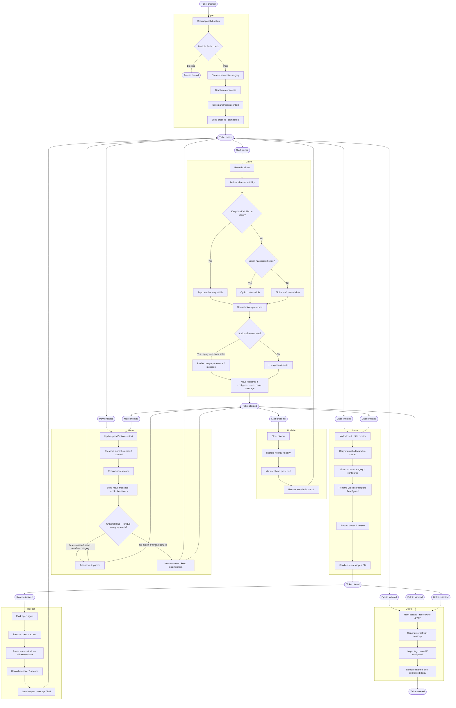

## Ticket Flow
<Accordion title="Flowchart" icon="diagram-project">
This is a flowchart of the ticket lifecycle. It is fairly comprehensive and covers all the major steps possible in the ticket lifecycle. You may need to zoom in.

</Accordion>

## Lifecycle Actions

<AccordionGroup>
  <Accordion title="1. Open" icon="door-open">
    When a ticket is opened:
    * The selected panel and option are recorded.
    * Blacklist and required-role checks run before the channel is created.
    * The channel is created in the option category or panel category.
    * The creator gets access.
    * The panel/option context is saved for later messages, logs, and variables.
    * The greeting message can be sent.
    * Timers begin - if configured.
  </Accordion>

  <Accordion title="2. Claim" icon="hand-holding">
    Claiming lets one staff member take ownership of a ticket.
    * The claimer is recorded.
    * Ticket visibility is reduced to the author, claimer, admins, and server owner by default.
    * If `Keep Staff Visible On Claim` is enabled on that option, the option support roles stay visible too.
    * If that option has no support roles, the server's global ticket staff roles stay visible instead.
    * Manually allowed users and roles stay allowed while the ticket remains open.
    * If the option has a claim category, the ticket is moved there on claim.
    * If the option has a claim rename template, the ticket is renamed on claim.
    * The claim message can be sent.

    <Info>
      **Ticket Profiles:**
      If the person claiming the ticket has a personal `tickets profile` configured, their claim category, rename template, and message can be overridden by their personal profile! Any profile field left blank falls back to the option's normal claim settings.

      Administrators can use `tickets profiles` to enable/disable profiles server wide, select a member, and edit that member's overrides. When server-wide profiles are disabled, saved personal profiles are kept but ignored until enabled again.
    </Info>
  </Accordion>

  <Accordion title="3. Unclaim" icon="hands-bound">
    Unclaiming removes the current ticket owner.
    * The claimer is cleared.
    * Normal ticket visibility is restored.
    * Manually allowed users and roles stay allowed.
    * The standard ticket controls come back.
  </Accordion>

  <Accordion title="4. Move" icon="arrow-right-arrow-left">
    Moving a ticket migrates it to another option without opening a new channel.
    * The panel/option context is updated.
    * The current claimer is preserved if the ticket is already claimed.
    * The move reason is recorded.
    * The move message can be sent.
    * Timers are recalculated against the new option.

    This applies to command-based moves and drag-based moves. If a ticket is moved with `tickets move`, `/move`, or a supported category drag, it keeps its current claim status.

    <Tip>
      **Drag-and-Drop Moves:**
      If an open ticket channel is dragged into a category that uniquely matches a ticket option's category, a panel's default category, or a panel's overflow category, the bot will try to treat that as a move automatically.

      If a claimed ticket is dragged somewhere that does not resolve to a unique move target, no automatic move is performed and the existing claim is kept. If a ticket is dragged into *Uncategorized*, no automatic move is performed. The channel stays uncategorized, and if the ticket was claimed, it stays claimed.
    </Tip>

    When using `tickets move` or `/move` on a non-ticket channel, you must have `Manage Channels`. For `/move`, provide the category parameter to pick the destination from Discord's category selector.
  </Accordion>

  <Accordion title="5. Close" icon="lock">
    Closing a ticket:
    * Marks it closed.
    * Hides the creator from the channel.
    * Also denies manually allowed users and roles while the ticket is closed.
    * If the option has a close category, the ticket is moved there on close.
    * If the option has a close rename template, the ticket is renamed on close.
    * Records who closed it and why.
    * Can send a close message and optional DM.
  </Accordion>

  <Accordion title="6. Reopen" icon="lock-open">
    Reopening a ticket:
    * Marks it open again.
    * Restores the creator.
    * Restores manually allowed users and roles that were hidden on close.
    * Records who reopened it and why.
    * Can send a reopen message and optional DM.
  </Accordion>

  <Accordion title="7. Delete" icon="trash">
    Deleting a ticket:
    * Marks the ticket deleted.
    * Records who deleted it and why.
    * Generates or refreshes a transcript before deletion, even if no log channel is configured.
    * Can log the final result in the configured log channel.
    * Removes the channel after the configured delete delay.
  </Accordion>
</AccordionGroup>

---

## Automation

Set configuration automation at the Option level to keep channels clean:

<AccordionGroup>
  <Accordion title="Inactivity Reminder" icon="zzz">
    If configured on the option:
    * The system tracks the creator's last message.
    * If they go quiet long enough, it sends the inactivity reminder.
    * If they reply again, the timer resets.
  </Accordion>

  <Accordion title="Auto-Close" icon="clock">
    If configured on the option:
    * The system tracks the same creator activity window.
    * If the creator stays inactive long enough, the ticket closes automatically.
    * The auto-close message is sent when that timer triggers.
    * `{ticket.closed_automatically}` becomes available for templates.
  </Accordion>

  <Accordion title="Auto-Delete After Close" icon="trash">
    If configured on the option:
    * Once a ticket is closed, a delete timer starts.
    * The auto-delete message is sent when that timer starts.
    * Reopening the ticket clears that timer.
    * Deleting the ticket manually clears that timer too.
    * When the timer expires, the closed ticket channel is deleted automatically.
  </Accordion>

  <Accordion title="Close On Leave" icon="person-walking-arrow-right">
    If `Close On Leave` is enabled on the option:
    * Any still-open ticket from that option closes automatically when the ticket creator leaves the server.
    * It uses the normal close flow instead of a special one-off shutdown path.
    * Close category moves, close rename templates, close messages, and close DMs still behave normally.
    * The recorded close reason becomes `"Ticket creator left the server."`
  </Accordion>
</AccordionGroup>

---

## Transcripts

Transcripts allow archival of ticket data in a log channel to be viewed later.

**The transcript system can:**
* Generate a transcript on demand.
* Generate or refresh a transcript automatically when a ticket is closed.
* Generate or refresh a transcript automatically when a ticket is deleted, even without a log channel.
* Refresh an existing transcript for the same ticket.
* Reuse the same transcript record instead of making endless duplicates.
* Include transcript links in logs and variables.
* Include transcript expiration timestamps in variables and the default transcript log.
* Fetch an existing saved transcript by case ID.

**Available access paths via commands:**
* `tickets transcript`
* `tickets transcript <case_id>`
* `/transcript`
* `/transcript case_id:<case_id>`
